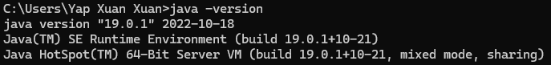
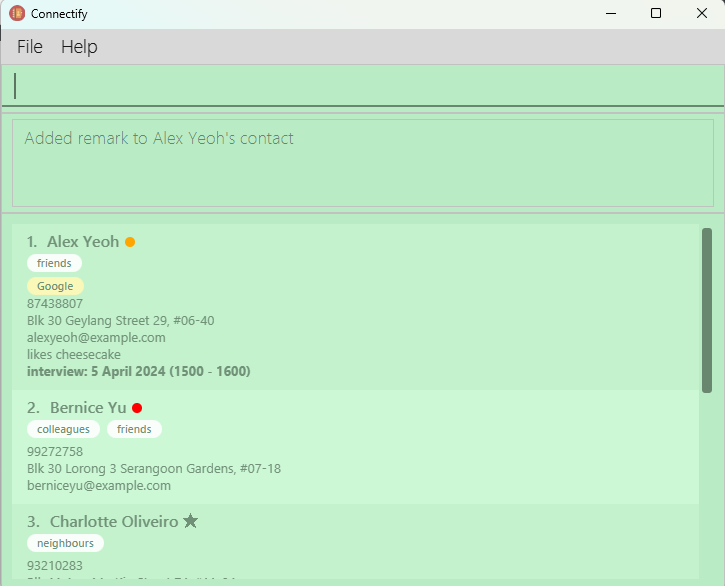
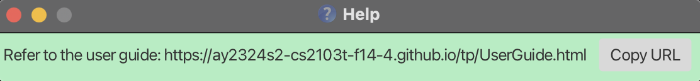
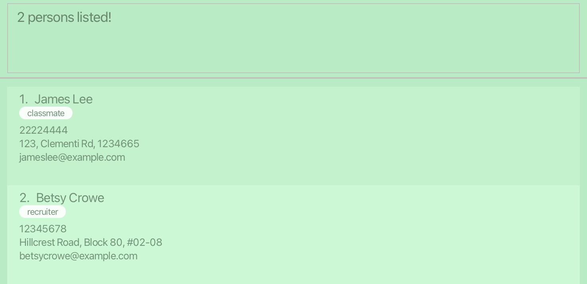
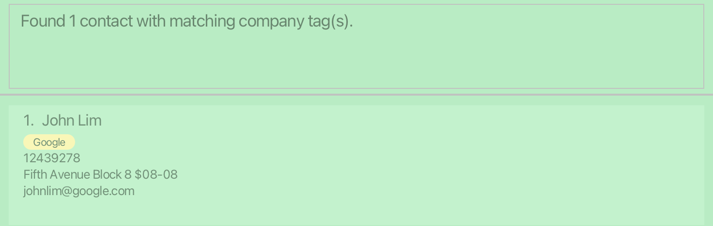

# Connectify User Guide 

Connectify is a **desktop application that optimises networking for your future career opportunities**. Connectify 
seamlessly organizes contact details, efficiently manages your professional relationships and simplifies meeting planning.
Designed for computing undergraduates, Connectify utilizes a Command Line Interface (CLI) while still having the benefits
of a Graphical User Interface (GUI). 

After networking at a career fest or a networking event, with the vast number of new connections you have made, it is easy 
to become overwhelmed by the large amount of information about your contacts. With Connectify, you can easily, effectively and 
efficiently keep track of your network and prioritize your networking efforts. This user guide provides you with an in-depth
understanding of how to navigate and utilize Connectify's features effectively.

Here is a brief overview of our key features:

- Adding a company attribute to a contact and finding contacts by their company
- Setting priority levels for contacts and filtering contact by a certain priority level
- Adding a meeting to a contact and viewing all meetings scheduled

With Connectify, networking becomes *easy, effective and efficient*.

**Streamline Your Connections, Accelerate Your Success.**

What are you waiting for? Download Connectify [here](https://github.com/AY2324S2-CS2103T-F14-4/tp/releases/tag/v1.3(final)) now, and **unlock your full networking potential**!

--------------------------------------------------------------------------------------------------------------------
## How to use this guide

Welcome to Connectify! If you are new to Connectify, you may wish to start setting up the application on your desktop device first
[here](#quick-start).

If you have finished setting up the application, great job! You may look through the detailed guide of how to navigate each of our
[features](#features).

Otherwise, if you are already familiar with Connectify and forgot some commands, you may refer to our comprehensive
[Command Summary](#command-summary).

Here are some of the icons that we use to give you extra information about our features:

<box type="info" seamless>

**Note:** This 'i' icon labelled 'Note' provides you with more detailed information about how to navigate
and use the features in Connectify.

</box>

<box type="tip" seamless>

**Tip:** This light bulb icon labelled 'Tip' provides you with special tips for you to be an expert with Connectify.  
</box>

--------------------------------------------------------------------------------------------------------------------

## Table of Contents
* [Quick Start](#quick-start)
* [Contact Attributes Summary](#contact-attributes)
* [Features](#features)
* [FAQ](#faq)
* [Known Issues](#known-issues)
* [Command Summary](#command-summary)
* [Glossary](#glossary)

--------------------------------------------------------------------------------------------------------------------

## Quick start

1. Ensure you have Java `11` or above installed in your Computer.  
How to check?
   1. Open Command Prompt (for Windows) or Terminal (for MacOS).
   2. Type the command `java -version` to check the version of java installed on your computer.  
   It should look like this:  
      
   3. If your java version installed is java 11 or above, move on to the next step! Else, download java version 11 [here](https://www.oracle.com/sg/java/technologies/downloads/#java11),
   before continuing to the next step.

1. Download the latest `connectify.jar` from [here](https://github.com/AY2324S2-CS2103T-F14-4/tp/releases).

1. Copy the file to the folder you want to use as the _home folder_ for your Connectify application.

1. Open a command terminal, `cd` into the folder you put the jar file in, and use the `java -jar connectify.jar` command to run the application. 
   A GUI similar to the below should appear in a few seconds. Note how the app contains some sample data.  
   

1. Type the command in the command box and press 'Enter' on your keyboard to execute it. e.g. typing **`help`** and pressing 'Enter' will open the help window. 
   Some example commands you can try:

   * `list` : Lists all contacts.

   * `add n/John Doe p/98765432 e/johnd@example.com a/John street, block 123, #01-01` : Adds a contact named `John Doe` 
   to Connectify.

   * `delete John Doe` : Deletes the contact with the specified contact name.
   
   * `edit John Doe n/John Tan` : edits the name attribute of the contact of `John Doe` to `John Tan`

   * `clear` : Deletes all contacts.

   * `exit` : Exits the app.

1. Refer to the [Features](#features) below for details of each command.

--------------------------------------------------------------------------------------------------------------------
## Contact Attributes

Attribute  | Description                                |  Required
-----------|--------------------------------------------|------------------------------------------------------------------------------------------------------------------------------------------
**Name**   | Name of the contact                        | Yes
**Phone Number**  | Phone number of the contact                | Yes  
**Email** | Email of the contact                       | No   
**Address**   | Address of the contact                     | No   
**Tag**   | Categories to sort the contact under       | No
**Company**  | Company of the contact                     | No
**Priority**  | Level of priority, from NONE, MED and HIGH | No  
**Remark** | Note added to a contact                    | No
**Meeting**  | Scheduled meeting with a contact with a specified date and time | No                                 
**Star**   | Importance of contact  | No  

--------------------------------------------------------------------------------------------------------------------

## Connectify Overview

## Contact Card View

## Features

<box type="info" seamless>

**Notes about the command format:** 

* Words in `UPPER_CASE` are the parameters to be supplied by the user. 
  e.g. in `add n/NAME`, `NAME` is a parameter which can be used as `add n/John Doe`.

* Items in square brackets are optional. 
  e.g `n/NAME [t/TAG]` can be used as `n/John Doe t/friend` or as `n/John Doe`.

* Items with `…`​ after them can be used multiple times including zero times. 
  e.g. `[t/TAG]…​` can be used as ` ` (i.e. 0 times), `t/friend`, `t/friend t/family` etc.

* Parameters can be in any order. 
  e.g. if the command specifies `n/NAME p/PHONE_NUMBER`, `p/PHONE_NUMBER n/NAME` is also acceptable.

* Extraneous parameters for commands that do not take in parameters (such as `help`, `list`, `exit` and `clear`) will be ignored. 
  e.g. if the command specifies `help 123`, it will be interpreted as `help`.

</box>

### Viewing help : `help`

Shows a message explaning how to access the help page.

Format: `help`
    
### Adding a contact: `add`

Adds a contact in Connectify.

Format: `add n/NAME p/PHONE_NUMBER [e/EMAIL] [a/ADDRESS] [t/TAG]…​`

<box type="info" seamless>

**Note:** In Connectify, contact names are case-insensitive and no duplicates are allowed. Hence `John Lim` is considered to be the
same person as `john lim`. As a result, you will see an error message if you try to add a contact with the same name as an existing contact,
even if it is in different case. Adding a contact with the same name as an existing contact, with extra spaces,
will produce a warning but does not prevent the user from doing so.
</box>
<box type="info" seamless>

**Note:** A person's name can only contain alphanumeric characters. Special characters are not allowed. 
The maximum length of a person's name is 50 characters.  
</box>
<box type="info" seamless>

**Note:** We allow duplicate phone number and email for contacts. This is to allow flexibility in using this feature
as some contacts may share the same general company email or phone number and not provide their personal information.
</box>
<box type="tip" seamless>

**Tip:** A person's email and address are optional. 
Placeholders `[email]` and `[address]` will be displayed if none are provided.  
A person can have any number of tags (including 0).  
</box>

Examples:
* `add n/John Doe p/98765432 a/John street, block 123, #01-01`
* `add n/Betsy Crowe t/recruiter e/betsycrowe@example.com a/Betsy street, block 456, #02-02 p/1234567`

### Listing all persons : `list`

Shows a list of all contacts in Connectify.

Format: `list`

### Editing a person : `edit`

Edits an existing contact shown in the displayed contact list.

Format: `edit NAME [n/NAME] [p/PHONE] [e/EMAIL] [a/ADDRESS] [t/TAG]…​`

* Edits the contact with the specified `NAME`. The specified `NAME` of the contact to edit is case-insensitive.  
    e.g `edit John Doe n/John` is the same as `edit john doe n/John`
* At least one of the optional fields must be provided.
* Existing values will be updated to the input values.
* When editing tags, the existing tags of the person will be removed i.e adding of tags is not cumulative. 
For instance, if current tags for the contact is `CS2101`, and you want to add an additional tag, you have to specify `CS2101` again.  
Like this: `edit Betsy t/CS2101 t/friends`
* You can remove all the person’s tags by typing `t/` without
    specifying any tags after it.

Examples:
*  `edit John Doe p/91234567 e/johndoe@example.com` Edits the phone number and email address of the contact named 
    `John Doe` to be `91234567` and `johndoe@example.com` respectively.
*  `edit Betsy n/Betsy Crower t/` Edits the name of the contact named `Betsy` to be `Betsy Crower` and clears all 
    existing tags.

### Finding contacts by their contact names: `find`

Finds persons whose names contain any of the given keywords.

Format: `find KEYWORD [MORE_KEYWORDS]`

* The search is case-insensitive. e.g `hans` will match `Hans`
* The order of the keywords does not matter. e.g. `Hans Bo` will match `Bo Hans`
* Only the name is searched.
* Partial words will be matched e.g. `Han` will match `Hans`
* Persons matching at least one keyword will be returned (i.e. `OR` search).
  e.g. `find Hans Bo` will return `Hans Gruber`, `Bo Yang`

Examples:
* `find John` returns `john` and `John Doe`
* `find james betsy` returns `James Lee`, `Betsy Crowe` 
  

### Deleting a person : `delete`

Deletes the specified contact shown in the displayed contact list.

Format: `delete NAME`

* Deletes the contact with the specified `NAME`. The specified `NAME` of the contact to delete is case-insensitive.  
  e.g `delete John Doe` is the same as `delete john doe`

Examples:
* `delete Betsy` deletes the contact with the contact name `Betsy` in Connectify.

### Adding a company attribute to a contact : `co`

Tags the specified company name to the specified contact shown in the displayed contact list.

Format: `co NAME c/COMPANY_NAME`

<box type="info" seamless>

**Note:** Each contact is only allowed to have one company attribute. If the contact already has an existing company attribute, 
the company attribute will be updated to the new one and a message will inform you the previous and updated company. 
</box>

* Tags the company name to the person's contact. The specified `NAME` of the contact to add the company attribute is 
case-insensitive. e.g `co John Doe c/TikTok` is the same as `co john doe c/TikTok`
* Entering `co NAME c/`, leaving the `COMPANY_NAME` as empty, will remove the company 
tag from a person's contact.  
If the person's contact did not have a company attribute and `co NAME c/` is entered, an error message will appear and the
person's contact will remain the same.

Examples:
* `co Betsy c/Google` adds the company attribute `Google` to the contact name `Betsy` in Connectify.
* `co Alex c/` removes the company attribute from the contact name `Alex` in Connectify.

### Locating persons by company : `findco`

Finds contacts whose company attribute exactly matches the specified keyword.

Format: `findco KEYWORD`

* Finds contacts by the company. The specified `KEYWORD` is
  case-insensitive. e.g `findco TikTok` is the same as `findco tiktok`
* The specified keyword has to be exactly the same as the person's company 
tag for the person to be found   e.g. the keyword `goog` will not match the company `google`

Examples:
* `findco Google` returns `John Lim`, who has a company attribute of `Google` in Connectify. 
  

### Prioritising a contact : `pr/PRIORITY_LEVEL`

Assigns the specified priority level to the specified contact or removes the priority level from the specified contact
shown in the displayed contact list.  
This command is aimed at assigning formal priority levels to contacts based on their importance or urgency.
Priorities help you manage your contacts in a more structured way,
especially in professional or organizational settings.

Format: `pr/PRIORITY_LEVEL NAME`

* The specified `NAME` of the contact to assign the priority level to is case-insensitive.  
e.g `pr/high Alex Tan` is the same as `pr/high alex tan`
* Acceptable values for `PRIORITY_LEVEL` are `high`, `med` and `none`. Entering any other values would 
be considered unknown commands.
* `pr/high NAME` assigns the `high` priority level to the specified contact.
* `pr/med NAME` assigns the `medium` priority level to the specified contact.
* `pr/none NAME` removes the priority level from the specified contact.  
If the person's contact did not have a priority level and `pr/none NAME` is entered, an error message will 
appear and the person's contact will remain the same.

Examples:
* `pr/high Alex Tan` assigns `high` priority level to the contact name `Alex Tan` in Connectify.
* `pr/none Alex Tan` removes the priority level from the contact name `Alex Tan` in Connectify.

### Filtering contacts by priority : `filter-PRIORITY_LEVEL`

Filters the contacts in Connectify by the specified priority level.

Format: `filter-PRIORITY_LEVEL`

* Acceptable values for `PRIORITY_LEVEL` are high and med.
* As the purpose of filtering by priority is so that users can easily identify 
and focus on only important contacts, filtering by priority level `none` is not an option.

Examples:
* `filter-high` returns a list of contacts with high priority.
* `filter-med` returns a list of contacts with medium priority.

### Adding a meeting to a person : `mtg`

Adds a meeting with a description and a date and time to the specified person shown in the displayed contact list.

Format: `mtg NAME m/MEETING_DESCRIPTION time/MEETING_TIME`

<box type="info" seamless>

**Note:** Each contact is only allowed to have one meeting. If the contact already has an existing meeting, 
the meeting details will be updated to the new one and a message will inform you the previous and updated meeting details. 
</box>
<box type="info" seamless>

**Note:** For now, users are allowed to set meeting dates that has passed. This is to provide users with flexibility in using
this feature. If you wish to use the meetings function to remember meetings that you had with a contact, you are able to
do so as well. 
</box>

* The specified NAME of the contact is case-insensitive.  
e.g `mtg john lim m/interview time/23-03-2024 1600-1700` is 
the same as `mtg John Lim m/interview time/23-03-2024 1600-1700`
* The specified MEETING_TIME must be of the format dd-MM-YYYY HHmm-HHmm.
* Note that the date specified has to be valid. For instance entering a date 31-02-2025 (31st february does not exist)
will throw an error.
* Entering `mtg NAME m/` or `mtg NAME` removes the meeting from the specified contact.  
If the person's contact did not have a meeting and `mtg NAME m/` is entered, 
an error message will appear and the person's contact will remain the same. 
* If `MEETING_DESCRIPTION` is entered, entering `MEETING_TIME` is mandatory.

Examples:
* `mtg Alex Tan m/interview time/05-11-2024 0800-0930`
* `mtg Alex Tan m/`

### Viewing all contacts with meetings : `viewmtgs`

Lists all contacts in Connectify that you have scheduled meetings with.

Format: `viemtgs`

### Adding a remark to a person : `remark`

Adds the specified remark to the specified contact shown in the displayed contact list.

Format: `remark NAME r/REMARK_DESCRIPTION`

* The specified `NAME` of the contact to add the company attribute is case-insensitive.  
e.g `remark John Doe r/met him at the career fair` is the 
same as `remark john doe r/met him at the career fair`
* Entering `remark NAME r/`, leaving the `REMARK_DESCRIPTION` as empty, will remove the remark
from a person's contact.  
If the person's contact did not have a remark and `remark NAME r/` is entered, an error message will appear and 
the person's contact will remain the same.

Examples:
* `remark Betsy r/likes cheesecake` adds the remark `likes cheesecake` to the contact name `Betsy` in Connectify.
* `remark Alex r/` removes the remark from the contact name `Alex` in Connecitfy.

### Getting the number of contacts : `count`

Shows the total number of contacts you have in Connecitfy.

Format: `count`

### Starring a contact : `star`
Stars the specific contact shown in the displayed contact list.  
The star command is designed to mark a contact with a star, indicating informal significance or personal preference.
It's a way to highlight certain contacts that you consider important or frequently interact with, such as close friends,
and frequent collaborators.

Format: `star NAME`

* Stars the contact with the specified `NAME`. The specified `NAME` of the contact to star is case-insensitive.  
  e.g `star John Doe` is the same as `star john doe`

Examples:
* `star Betsy` stars the contact with the contact name `Betsy` in Connecitfy.

### Removing the star from a contact : `unstar`

Removes the star from the specified contact shown in the displayed contact list.

Format: `unstar NAME`

* Removes the star from the contact with the specified `NAME`. The specified `NAME` of the contact 
to remove the star from is case-insensitive.  
  e.g `unstar John Doe` is the same as `unstar john doe`

Examples:

* `unstar Betsy` removes the star from the contact with the contact name `Betsy` in Connecitfy.

### Clearing all entries : `clear`

Clears all contacts from Connectify.

Format: `clear`

### Exiting the program : `exit`

Exits the program.

Format: `exit`

### Go to previous commands: Press Arrow Up button / Press Arrow Down button on your computer keyboard

Suppose the commands entered are: 
Command 1: list
Command 2: edit John Doe n/John
Command 3: edit Alex Yeoh p/23456789

After executing Command 3,  
Pressing the arrow up button once will display: edit Alex Yeoh p/23456789
Pressing the arrow up button again will display: edit John Doe n/John
Pressing the arrow up button once more will display: list
Further pressing the arrow up button will not change the command box content as it reaches the earliest command.

After navigating up, pressing arrow down button once will display: edit John Doe n/John
Pressing arrow down button again will display: edit Alex Yeoh p/23456789
Further pressing the arrow down button will not change the command box content as it reaches the latest command.

### Saving the data

The address book data is saved in the hard disk automatically after any command that changes the data. There is no need to save manually.

### Editing the data file

The address book data is saved automatically as a JSON file `[JAR file location]/data/addressbook.json`. Advanced users are welcome to update data directly by editing that data file.

<box type="warning" seamless>

**Caution:**
If your changes to the data file makes its format invalid, Connectify will discard all data and start with an empty data file at the next run.  Hence, it is recommended to take a backup of the file before editing it. 
Furthermore, certain edits can cause Connectify to behave in unexpected ways (e.g., if a value entered is outside the acceptable range). Therefore, edit the data file only if you are confident that you can update it correctly.
</box>

--------------------------------------------------------------------------------------------------------------------

## FAQ

**Q**: Can I run Connectify on any operating system? 
**A**: Yes, as long as you have Java 11 or above installed, Connectify should run on any operating system that supports Java.

**Q**: Can I use Connectify offline? 
**A**: Yes, Connectify is a desktop application, so it can be used offline once it's downloaded and installed on your computer.

**Q**: How do I transfer my data to another Computer? 
**A**: Install the app in the other computer and overwrite the empty data file it creates with the file that contains the data of your previous Connectify home folder.

**Q**: How do I handle data storage and saving? 
**A**: Connectify automatically saves contact data to a JSON file located in the same directory as the jar file. There's no need to save manually as changes are saved automatically.

**Q**: What's the difference between the purpose of Priority and Star command? 
**A**: Priority levels are used for formal categorization and organization of contacts based on their importance or urgency. Stars are typically used for personal preference rather than formal categorization. You might star contacts you frequently communicate with or those you consider important in a personal context.

--------------------------------------------------------------------------------------------------------------------

## Known issues

1. **When using multiple screens**, if you move the application to a secondary screen, and later switch to using only the primary screen, the GUI will open off-screen. The remedy is to delete the `preferences.json` file created by the application before running the application again.

--------------------------------------------------------------------------------------------------------------------

## Command summary

Action                                                                          | Format, Examples |
--------------------------------------------------------------------------------|-----------------------------------------------------------------------------------------------------------------------------------------------------------------
 [**Add**](#adding-a-contact-add)                                              | `add n/NAME p/PHONE_NUMBER e/EMAIL a/ADDRESS [t/TAG]…​`   e.g., `add n/James Ho p/22224444 e/jamesho@example.com a/123, Clementi Rd, 1234665 t/friend t/colleague`
 [**List**](#listing-all-persons-list)                                         | `list`
 [**Edit**](#editing-a-person-edit)                                            | `edit NAME [n/NAME] [p/PHONE_NUMBER] [e/EMAIL] [a/ADDRESS] [t/TAG]…​`  e.g.,`edit James n/James Lee e/jameslee@example.com`
 [**Find**](#finding-contacts-by-their-contact-names-find)                     | `find KEYWORD [MORE_KEYWORDS]`  e.g., `find James Jake`
 [**Delete**](#deleting-a-person-delete)                                       | `delete NAME`  e.g., `delete John Doe`
 [**Add Company Tag**](#adding-a-company-tag-to-a-contact-co)                  | `co NAME c/COMPANY_NAME`  e.g., `co James Doe c/TikTok`
 [**Find by Company Tag**](#locating-persons-by-company-tag-findco)            | `findco COMPANY_NAME`  e.g., `findco TikTok`
 [**Assign Priority**](#prioritising-a-contact-pr-priority-level)                | `pr/PRIORITY_LEVEL NAME`  e.g., `pr/high Alex Tan`
 [**Filter by Priority**](#filtering-contacts-by-priority-filter-priority-level) | `filter-PRIORITY_LEVEL`  e.g., `filter-high`
 [**Add Meeting**](#adding-a-meeting-to-a-person-mtg)                          | `mtg NAME m/MEETING_DESCRIPTION time/MEETING_TIME`  e.g., `mtg Alex Tan m/interview time/05-11-2024 0800-0930`
 [**View Meetings**](#viewing-all-contacts-with-meetings-viewmtgs)             | `viewmtgs`
 [**Add Remark**](#adding-a-remark-to-a-person-remark)                         | `remark NAME r/REMARK_DESCRIPTIONE`  e.g., `remark john doe r/met him at the career fair`
 [**Count**](#getting-the-number-of-contacts-count)                            | `count`
 [**Star**](#starring-a-contact-star)                                          | `star NAME`  e.g., `star John Doe`
 [**Unstar**](#removing-the-star-from-a-contact-unstar)                        | `unstar NAME`  e.g., `unstar John Doe`
 [**Clear**](#clearing-all-entries-clear)                                      | `clear`
 [**Exit**](#exiting-the-program-exit)                                         | `exit`
 [**Help**](#viewing-help-help)                                                | `help` |

--------------------------------------------------------------------------------------------------------------------

## Glossary

* **CLI** (Command Line Interface): A text-based interface used for interacting with software through commands typed into a terminal or console.

* **GUI** (Graphical User Interface): A visual way of interacting with software using graphical elements like windows, icons, and buttons.

* **JAR** (Java ARchive): A file format used for aggregating many files into one archive, particularly used for distributing Java programs or libraries.

* **JSON** (JavaScript Object Notation): A lightweight data-interchange format used for storing and exchanging data. It is human-readable and easy for machines to parse and generate.

* **Parameter**: A variable in a command that represents a value that the command expects you to provide.

* **Priority Level**: A designation indicating the importance or urgency of a contact. Connectify supports priority levels such as high, medium, and none.

* **Tag**: A label or keyword assigned to a a contact to facilitate categorization and organization. In Connectify, contacts can be tagged with keywords to group them based on shared characteristics.

[Return to top](#connectify-user-guide)
